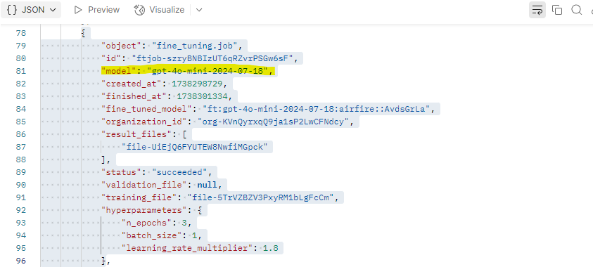

# Git
Git is the language that lets a user interact with Github (The repository system/platform) via the terminal.

# Storing the API Key
It is common practice to hide or ignore your api key when storing your code to a public repository such as Github. 

A neat feature that git offers is the .gitignore file. Here you can tell Git to automatically ignore certain files whenever you add or commit changes to your working branch in Github. 

For example, node_modules, the actual packages/modules that are called upon for their special toolings and functions to allow the software engineer to solve then problem at hand, are usually massive memory wise. Constantly uploading this folder to Github would impede load times, and considering that they are individually stored else where and are periodically updated. It would be a waste of time to store them on the Github Repository.

Also as mentioned previously, hiding API keys is also a function .gitignore can accomplish. In our case we ignore a whole file type, the environment or .env. Frankie had some problems hiding this file initially because he named then file he desired to ignore as "api.key.env" not recognizing he has extended multiple file types via the period ".". After he renamed the file to simple ".env" did the .gitignore actually work in hiding the api key from ever being uploaded to Github.

# Finding Unique Trained Model ID
Members Sam and Yiyu trained a ChatGPT 4o-mini model with a combination of prompt engineering and fine tuning.  This Fine-Tuning (FT) job instantiates a brand new unique model based off of the 4o-mini model and the response of the aforementioned job returns the model id to reference.

Frankie was accidentally given the FT model id, not the model id. So when updating API calls from the webapp to hit the API endpoint of the newly created trained model, Frankie was recieving a 404 error. This normally means that the endpoint does not exist. Only after leveraging a handy tool called Postman and reading [OPENAI docs](https://platform.openai.com/docs/api-reference/fine-tuning/list) did Frankie find that the full response looked like this: 

# Temperature, the hyperparameter
ChatGPT has a hyperparameter named: temperature. This hyperparameter deictacts how dilligent or random the incoming inquiry is processed. By including this parameter in the initial form on this webapp's landing page, users can play around with how strict or freeform they want this tool to translate the incoming smoke outlook in English to Spanish.